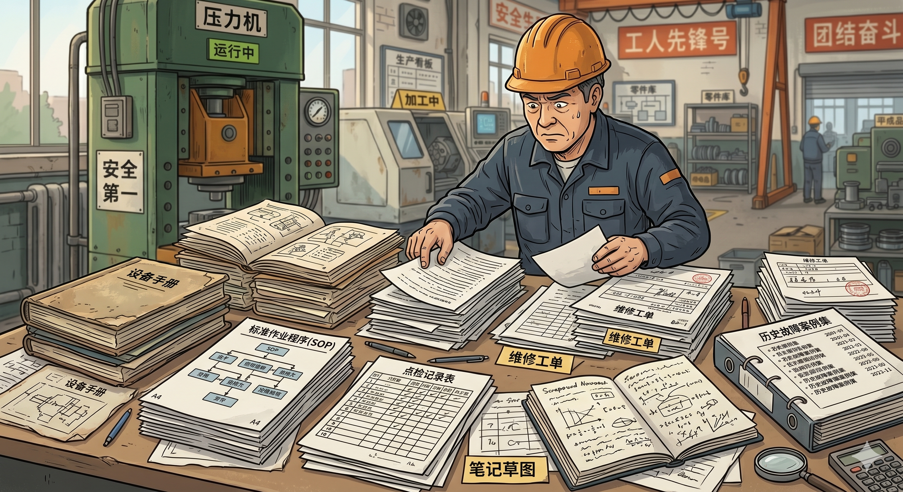
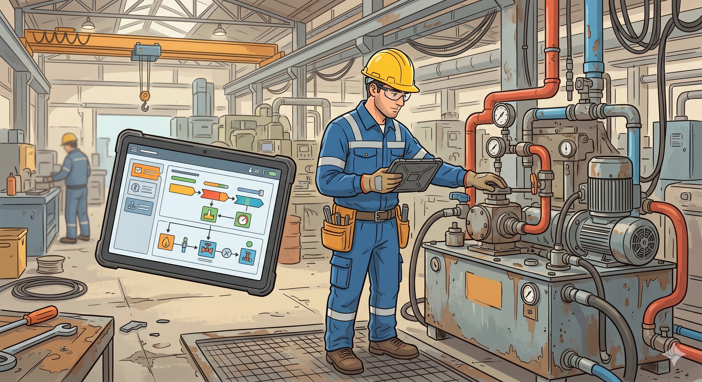
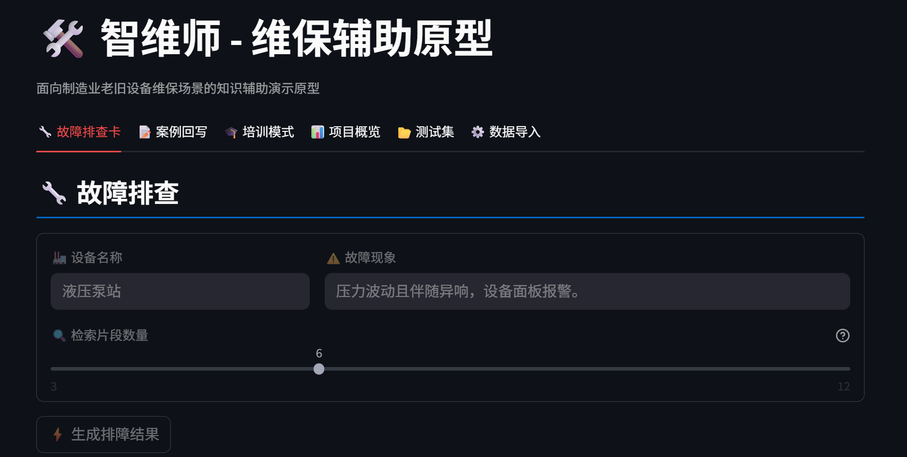
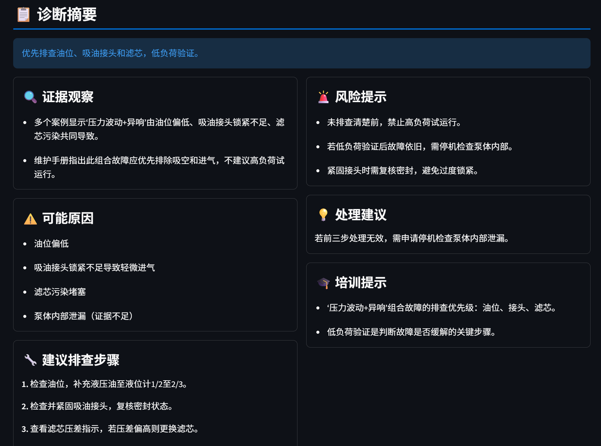
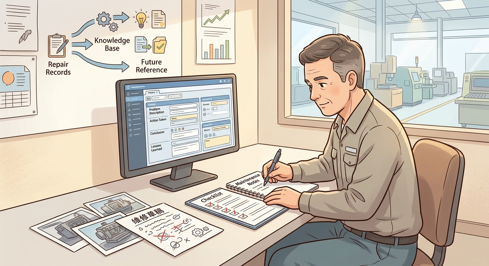
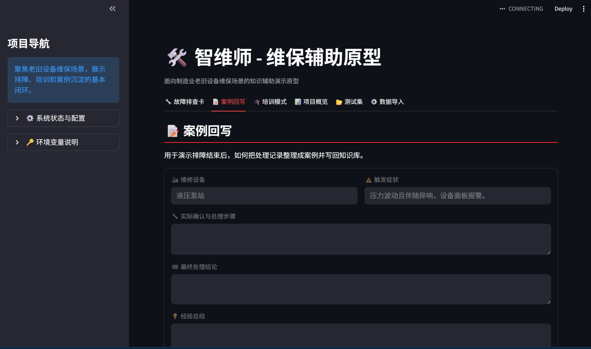
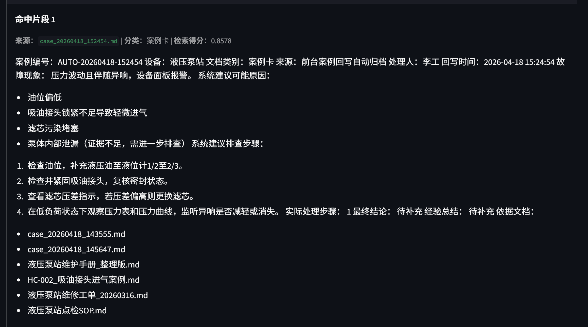

# 非技术组员交接包汇编版

---

## 本汇编版包含什么

本汇编版按顺序收录下面四部分：

1. 先把整个项目听明白。
2. 你们现在接手的是哪一段。
3. PoC 怎么组织，按这个版本执行。
4. PoC 做完后，后续工作怎么推进。

---

## 第一部分：先把整个项目听明白

*图：老旧设备维保的典型背景场景示意。*

---

### 项目在做什么

“智维师”是一个面向老旧设备维保场景的辅助方案。它不是在讲一个很泛的工业 AI 概念，而是在解决一个很具体的问题：当设备出现异常时，现场人员怎么更快找到依据，先做出相对稳妥的初步判断，再把这次处理经验留住。

### 这个项目对应什么场景

可以把使用者理解成车间里负责值班、巡检或初步排查的人。这个人不一定是最有经验的老师傅，但设备一报警，他就得先上手处理。

比如夜班时，一台液压泵站出现压力波动，而且伴随异响，设备面板也开始报警。值班人员这时候不能直接靠感觉处理，也不能把所有资料从头到尾重翻一遍。他最先需要的，是先找到依据，判断先看哪里、先查什么、哪些动作现在能做、哪些风险现在不能碰。

这个项目要处理的，就是这条链条里资料分散、经验依赖强和案例难沉淀的问题。

### 没有这个系统时，他通常怎么处理

没有系统时，现场人员往往会按下面这个方式处理：

1. 先看报警和现象，凭经验做一个初步猜测。
2. 再去翻说明书、SOP、点检记录、维修工单和历史案例。
3. 如果现场一时拿不准，就再去问老师傅或者找以前处理过的人。
4. 最后把这些零散信息拼起来，形成一版自己的排查顺序。

这套做法不是完全不能用，但很依赖个人经验，也很容易花时间在反复翻资料和来回确认上。

*图：没有系统时，现场人员往往要在多份资料和记录里来回翻找，才能拼出一版初步判断。*

---

### 有这个系统时，他会怎么处理

有系统时，现场人员的动作会更集中一些：

1. 先输入设备名称和故障现象。
2. 系统从已有手册、SOP、维修记录和历史案例里找相关依据。
3. 系统把可能原因、风险提示和建议排查步骤整理成结构化结果。
4. 现场人员据此先做初步检查和低风险验证。
5. 处理结束后，再把这次过程回写成案例，留给下一次使用。

也就是说，这个系统不是替人做决定，而是先把原来分散的依据和排查线索整理出来，让人更快进入正确的处理路径。

### 用一个具体例子说明

还是以“液压泵站压力波动且伴随异响”为例。

没有系统时，值班人员通常要先翻液压泵站手册，再找点检 SOP、旧维修工单和历史案例，边看边猜这次更像是油位问题、接头进气还是滤芯堵塞。如果现场经验不足，这一步就容易卡住。

有系统时，他只需要先把“液压泵站”和“压力波动且伴随异响，设备面板报警”输进去，系统就会先把相关依据收拢出来，再给出一版结构化结果，比如优先排查油位、吸油接头和滤芯，同时提醒先做低负荷验证，不要直接高负荷试运行。这样他不是从零开始拼资料，而是从一版已经整理好的排查框架开始往下做。

---

### 这个项目具体包含哪些内容

如果站在使用者角度理解，这个项目主要把下面四件事接起来：

1. 平时先把说明书、SOP、点检日志、维修记录和历史案例整理起来。
2. 设备出现异常时，根据故障现象给出结构化的排障辅助结果。
3. 在排障结果基础上，再补上培训提示，帮助新人理解为什么这样查。
4. 处理完成后，把这次过程整理成案例卡，再回到知识库里。

如果用一句更简短的话概括，这个项目做的是“先把资料收拢，再把排查过程组织清楚，最后把经验沉淀下来”。

*图：有系统时，使用者先输入设备和故障现象，系统再把依据、风险和排查步骤整理出来。*

---

### 为什么选这个方向

这个方向和比赛背景是连得上的，也比较适合当前团队的推进节奏。它有几个比较清楚的特点：

1. 场景足够具体。
2. 问题真实存在。
3. 既能做出原型，也能继续做验证。
4. 适合组织成“问题 - 方案 - 样机 - 验证 - 落地”的完整表达。

---

### 项目现在做到哪一步了

现在项目已经有一个可运行的原型。原型目前能展示下面几项内容：

1. 故障排查辅助。
2. 培训模式。
3. 案例回写。
4. 知识库和测试集展示。

*图：当前原型的故障排查输入页面。*

*图：当前原型可展示的结构化排障结果。*

也就是说，项目已经不是只有想法，而是已经有了一个可以继续拿去做验证和展示的样机。

---

### 当前阶段重点是什么

当前阶段的重点，是把现有原型继续往下接成完整作品。这里最需要补的两类内容是：

1. PoC 结果，也就是一组能说明原型有辅助价值的初步验证证据。
2. 后续材料，也就是项目简介、PPT、视频和其他参赛材料。

---

### 为什么会由你们接手

因为接下来的关键工作里，有很大一部分是组织和推进工作，而不只是技术工作。后面的重点包括：

1. 协调人和时间。
2. 执行 PoC。
3. 整理结果和截图。
4. 把项目继续组织成参赛材料。

这部分工作如果接得顺，整套项目后面会非常清楚。

---

### 项目当前比较适合的理解方式

接下来不管是 PoC 还是后续材料，都可以围绕同一条主线来理解：

1. 东北制造业升级背景下，老旧设备维保仍然有知识分散、经验依赖和案例难沉淀的问题。
2. 项目选择这个具体问题切入。
3. 方案的核心是“资料整理 - 排障辅助 - 培训支持 - 案例回写”这条闭环。
4. 现在已经有原型，下一步是用 PoC 把这条闭环进一步验证出来。

---

### 一段简短的转述版本

如果后面需要向别人解释这个项目，可以直接用下面这段：

“这个项目做的是老旧设备维保场景下的辅助方案。它处理的核心问题是资料分散、经验依赖强、新人上手慢和案例难沉淀。现在已经有一个可运行的原型，能展示排障、培训和案例回写闭环，接下来重点是把 PoC 和后续材料接起来。”

---

## 第二部分：你们现在接手的是哪一段

---

### 当前阶段是什么

这个项目现在已经从原型开发阶段进入了整理和推进阶段。当前比较清楚的工作顺序是：

1. 先完成 PoC。
2. 再把项目简介、PPT、视频这些材料接起来。
3. 最后继续扩展成更完整的比赛材料。

因此，你们现在接手的是“把现有原型继续往完整作品推进”这一段。

---

### 你们接下来主要负责什么

接下来主要有两块工作会落到你们这里：

#### 第一块：把 PoC 真正执行出来

这里需要做的是把测试者、任务、时间、记录表、截图和结果整理这些内容全部接起来，让 PoC 真正落地。

#### 第二块：把 PoC 之后的材料继续往前推

PoC 完成以后，后面会自然接上项目简介、PPT、视频和其他材料。你们这一段工作的作用，是把 PoC 结果转成后续材料可以直接使用的内容。

---

---

---

### 后续工作的基本节奏

后面这段工作可以一直按下面这个节奏理解：

1. 先做 PoC。
2. 拿到结果表和截图。
3. 用这些结果继续写项目简介和搭 PPT。
4. 再往后接视频和其他材料。

这个顺序比较重要，因为后面的内容都建立在前面的结果上。

---

---

### 这一份的结论

你们现在接手的是项目推进和组织这一段。当前最主要的工作，是把 PoC 做出来，并把 PoC 结果继续接成后续材料。

---

## 第三部分：PoC怎么组织，按这个版本执行

*图：PoC 一里，系统辅助模式主要使用这个页面。*

---

### 这轮 PoC 包含什么

这轮 PoC 包含两个部分：

1. 排障任务对照验证。
2. 案例回写复用验证。

第一部分是现场组织执行，第二部分由项目组内部完成。两部分加起来，目的是形成一组可以直接进入后续材料的验证结果。

---

### 这轮 PoC 想回答什么问题

当前主要想回答两件事：

1. 人在借助原型后，是否能更快、更有依据地完成初步排查。
2. 一次处理过程回写到知识库以后，系统能否在后续同类问题里再次命中这条案例。

---

### 现场重点放在哪一部分

这轮 PoC 里，现场执行的重点放在第一部分，也就是排障任务对照验证。原因是这部分需要测试者、计时、收表和现场组织。第二部分更多是项目组内部完成的流程验证。

---

### 第一部分怎么理解

第一部分可以理解成一轮小规模对照测试。当前的基本安排是：

1. 找 4 名测试者。
2. 使用 4 个固定任务。
3. 每位测试者做 2 个任务。
4. 其中 1 个任务采用人工查资料方式，1 个任务采用系统辅助方式。

最后比较两种方式在依据定位和结果质量上的差异。

*图：系统辅助模式会输出结构化排障结果，后续统一进入 judge。*

---

### 当前任务设置

当前建议使用的 4 个任务是：

1. T1：液压泵站压力波动且伴随异响。
2. T2：液压泵站油温连续偏高，冷却器状态正常。
3. T3：数控主轴单元振动异常且加工精度下降。
4. T4：数控主轴单元温升偏高并伴随异响。

如果现场执行时不再调整任务，这 4 个任务可以直接作为当前版本使用。

---

### 现场最少需要哪些人

建议现场最少有下面几类角色：

1. 4 名测试者。
2. 1 名主持人。
3. 1 名计时记录员。
4. 1 名技术保障员。

如果人数有限，主持人和技术保障员可以由同一人兼任。

---

### 你们两位分别接什么工作

你们两位比较适合按下面方式分工：

1. 一人负责主持和组织。
2. 一人负责记录和归档。

#### 主持和组织这边主要做什么

1. 联系测试者。
2. 确认时间、场地和到场顺序。
3. 发任务卡和答案卡。
4. 说明规则。
5. 控制每一轮的开始和结束。

#### 记录和归档这边主要做什么

1. 维护时间记录表。
2. 记录第一次依据定位时间。
3. 回收答案卡。
4. 拍照、命名和归档。
5. 整理当天的结果总表和后续判分输入包。

---

### 前一天要准备什么

在正式执行前一天，建议把下面几项全部确认好：

1. 原型可以正常运行，并且版本固定。
2. 当前知识库版本已经更新完成。
3. 4 个任务文本已经定稿。
4. 任务卡、答案卡和时间记录表已经准备好。
5. 4 名测试者已经联系确认。
6. 场地、电源、浏览器和投屏都可用。
7. 现场技术保障员已经确定。

---

### 现场当天怎么跑

现场当天可以按下面这个顺序执行：

1. 给测试者编号，发第 1 轮任务卡和答案卡。
2. 主持人统一说明规则。
3. 第 1 轮开始，记录员同步计时。
4. 测试者第一次定位到准备采用的依据时，记录员登记时间。
5. 8 分钟结束后收回答案卡。
6. 切换任务和模式，进行第 2 轮。
7. 第 2 轮结束后，回收并整理全部答案卡。
8. 当天同步完成拍照、转录和总表更新。

---

### 现场规则怎么说明

当天建议统一说明下面几条规则：

1. 每位测试者做两轮任务。
2. 每轮 8 分钟。
3. 第一次找到准备采用的依据时，需要明确示意。
4. 所有答案统一写在答案卡上。
5. 时间到后立即停止。

这些规则主要是为了保证记录方式统一。

---

### 当天要留存哪些材料

第一部分执行完成后，建议至少保留下列材料：

1. 测试者基础信息表。
2. 任务分配表。
3. 时间记录表。
4. 答案卡照片或扫描件。
5. 答案卡转录文本。

这些内容会直接用于后续统一判分、结果汇总和 PPT 整理。

---

### 第二部分怎么理解

第二部分是案例回写复用验证，不需要重新组织一批测试者。可以把它理解成项目组内部完成的一次流程验证，步骤如下：

1. 选一个当前有依据、但没有完整案例卡的任务。
2. 保留回写前提问和检索截图。
3. 按模板补全处理步骤、最终结论和经验总结。
4. 完成回写并更新知识库。
5. 再次输入同类问题，保留命中新案例的截图。

*图：一次处理经验被整理、沉淀并转入后续可复用的案例。*

*图：PoC 二主要使用案例回写页面完成内部验证。*

---

### 第二部分要保留哪些材料

第二部分建议至少保留下列内容：

1. 回写前问题截图。
2. 样本处置记录。
3. 新生成案例卡截图。
4. 回写后二次检索命中新案例的截图。

*图：案例回写后，再次提问时需要保留命中新案例的检索结果。*

---

### 当天结束前最好形成什么

如果当天整理顺畅，建议在结束前至少形成下面这些：

1. 一张 PoC 一结果总表。
2. 一组答案卡与转录文本。
3. 一组 PoC 二前后截图。
4. 一段简短验证结论底稿。

这些结果一旦形成，后面继续整理项目简介、PPT 和视频会快很多。

---

### 这份文档怎么用

这份文档可以直接当作你们的执行提纲来用。现场真正需要更细的流程、字段和归档目录时，再对照 [12_poc_onsite_execution.md](../12_poc_onsite_execution.md) 即可。

---

## 第四部分：PoC做完后，后续工作怎么推进

---

### PoC 做完以后意味着什么

PoC 做完以后，项目就不再只是“有一个原型”，而是开始有了一组可以继续进入后续材料的验证结果。因此，PoC 结束更适合被理解为后续材料整理的起点。

---

### 后续工作的顺序

PoC 完成后，后面的工作建议按下面顺序推进：

1. 先整理 PoC 结果。
2. 再写项目简介。
3. 再搭 PPT 骨架。
4. 再准备视频脚本和录屏。
5. 最后继续扩展长材料。

这个顺序能保证每一步都建立在前一步已经稳定下来的内容上。

---

### 第一步：先把 PoC 结果整理出来

PoC 结束后，建议先整理出下面几项：

1. 一张结果总表。
2. 一段简短验证结论。
3. 一组回写前后截图。
4. 一份可直接交给后续写作者和制作者使用的小结。

这一步完成后，后面的项目简介和 PPT 会顺很多。

---

### 第二步：继续写项目简介

项目简介需要简洁地回答四个问题：

1. 项目解决的是什么问题。
2. 为什么这个问题真实存在。
3. 方案的核心是什么。
4. 当前已经做到哪一步，并验证了什么。

PoC 做完以后，这第四部分就有了比较明确的内容。

---

### 第三步：继续搭 PPT

PPT 的主线建议保持稳定，当前比较合适的顺序是：

1. 问题定义。
2. 场景和背景依据。
3. 解决方案与工作闭环。
4. 原型演示。
5. PoC 验证结果。
6. 落地路径。

这套顺序比较容易和项目简介、视频脚本保持一致。

---

### 第四步：再准备视频

视频更适合放在项目简介和 PPT 主线都稳定之后。这样做时，录屏和讲述顺序都比较容易固定，不需要反复重来。

---

### PoC 做完以后，你们这一段工作的重点

PoC 阶段的重点是组织现场，PoC 之后的重点则是整理素材。后续最值得先收拢的是：

1. 题目和一句话定位。
2. 核心痛点表述。
3. 背景证据。
4. PoC 结果表。
5. 回写前后截图。
6. 原型截图。
7. 一段落地路径说明。

这些内容一旦收拢好，后面的写作和展示都会轻松很多。

---

---

### 这一份的结论

PoC 做完以后，工作重点会从“组织执行”转到“整理结果并接成后续材料”。这一步接得顺，后面整套项目的推进会清楚很多。