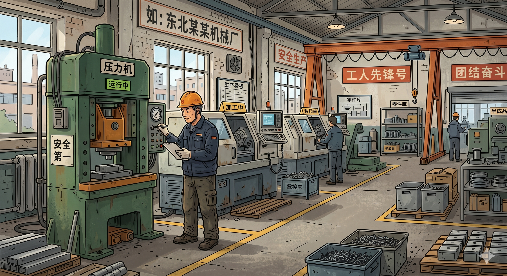

# 给两位非技术组员的交接包

*图：老旧设备维保场景的背景示意。后续 PoC 和材料整理都围绕这类真实场景展开。*

---

这套文档对应你们接下来要接手的两块工作：

1. 组织和落地 PoC。
2. 在 PoC 之后继续推进项目简介、PPT、视频和其他材料。

这套文档不展开技术实现，重点放在项目本身、当前阶段、PoC 执行和后续推进顺序上。

---

## 阅读顺序

如果是为了直接阅读或转成 PDF，建议优先使用：

1. `00_非技术组员交接包_汇编版.md`

建议按下面顺序阅读：

1. `01_先把整个项目听明白.md`
2. `02_你们现在接手的是哪一段.md`
3. `03_PoC怎么组织_按这个版本执行.md`
4. `04_PoC做完后_后续工作怎么推进.md`
5. `05_你们和技术组怎么配合.md`

---

## 每份文档的作用

1. `01_先把整个项目听明白.md`：介绍项目内容、场景和当前状态。
2. `02_你们现在接手的是哪一段.md`：说明当前阶段的重点，以及你们接下来主要负责什么。
3. `03_PoC怎么组织_按这个版本执行.md`：说明这轮 PoC 的结构、流程和当天要留存的材料。
4. `04_PoC做完后_后续工作怎么推进.md`：说明 PoC 完成后，后续材料按什么顺序推进。
5. `05_你们和技术组怎么配合.md`：说明和技术组的配合方式与交接节点。

---

## 如果先看核心内容

可以先看下面两份：

1. `01_先把整个项目听明白.md`
2. `03_PoC怎么组织_按这个版本执行.md`

如果想一次性看完 01 到 04，也可以直接看：

1. `00_非技术组员交接包_汇编版.md`

---

## 格式说明

这套文档目前先保留为 Markdown，方便继续修改。后面如果需要统一发给组员，可以再转成 PDF。